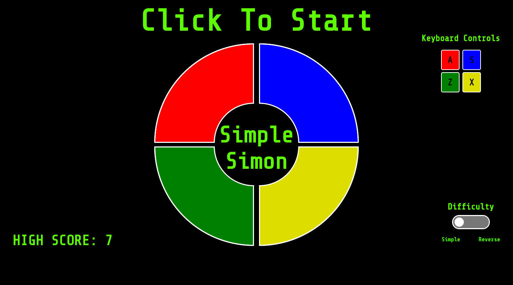
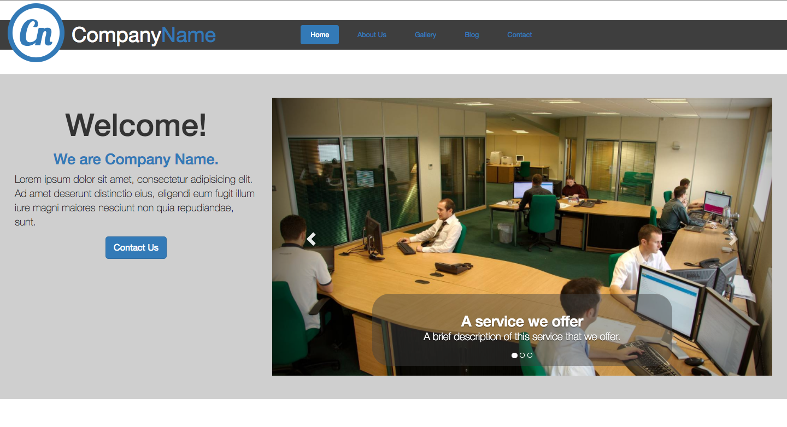
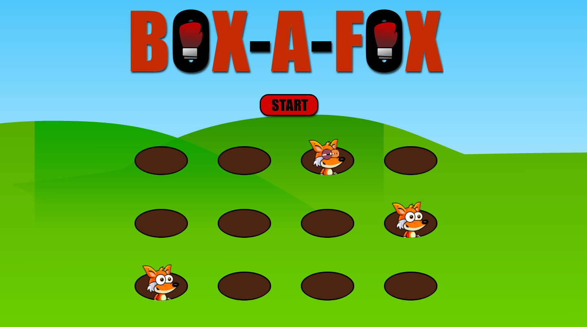

        
<i class="material-icons" id="navLeft">navigate_before</i>

        

            

                
                

                    <h2>Texas Affordable Appliance</h2>
                    
A static website for a local appliance repair company to create a web presence with information about the company.

                    <tags>HTML</tags>
                    <tags> CSS</tags>
                    <tags>Javascript</tags>
                    <tags>Google Maps API</tags>
                    <a href="https://github.com/larryg727/texasaffordableappliance" target="_blank">
                        
Check out the code.
</a>
                    </a>
                

            

            

                
                

                    <h2>Simple Simon</h2>
                    
A clone of the memory game Simon. Game includes both a regular and reverse level. Speeds increase as the rounds increase.

                    <tags>HTML</tags>
                    <tags> CSS</tags>
                    <tags>Javascript</tags>
                    <tags> JQuery</tags>
                    <a href="https://github.com/larryg727/simple-simon" target="_blank">
                        
Check out the code.
</a>
                    </a>
                

            

            

                
                

                    <h2>Website Template</h2>
                    
A fully functional and mobile responsive website built around a generic company to be used as a template.

                    <tags>HTML</tags>
                    <tags> CSS</tags>
                    <tags>Bootstrap</tags>
                    <tags>Javascript</tags>
                    <tags>Jquery</tags>
                    <a href="https://github.com/larryg727/site-template" target="_blank">
                        
Check out the code.
</a>
                    </a>
                

            

            

                
                

                    <h2>Box-A-Fox</h2>
                    
A Whack-a-Mole game variation created using HTML, CSS, Javascript, & JQuery. 

                    <tags>HTML</tags>
                    <tags> CSS</tags>
                    <tags>Javascript</tags>
                    <tags> JQuery</tags>
                    <a href="https://github.com/larryg727/box-a-fox" target="_blank">
                        
Check out the code.
</a>
                    </a>
                

            

            

                
                

                    <h2>Weather Application</h2>
                    
A weather app demonstrating the integration of Google maps API and the Open Weather API.

                    <tags>HTML</tags>
                    <tags> CSS</tags>
                    <tags>Javascript</tags>
                    <tags> JQuery</tags>
                    <tags>API integration</tags>
                    <a href="https://github.com/larryg727/weatherApp" target="_blank">
                        
Check out the code.
</a>
                    </a>
                

            

            

                
                

                    <h2>Javascript Calculator</h2>
                    
A functional calculator with all functions created with vanilla Javascript.

                    <tags>HTML</tags>
                    <tags> CSS</tags>
                    <tags>Javascript</tags>
                    <a href="https://github.com/larryg727" target="_blank">
                        
Check out the code.
</a>
                    </a>
                

            

        

        
<i class="material-icons" id="navRight">navigate_next</i>

    
