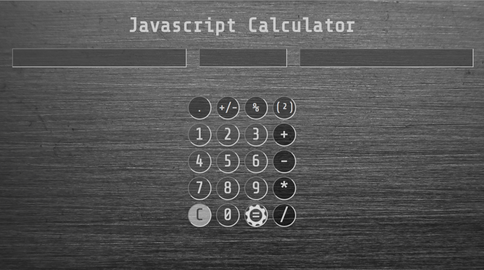

        
<i class="material-icons" id="navLeft">navigate_before</i>

        

            

                
                

                    <h2>Texas Affordable Appliance</h2>
                    
A static website for a local appliance repair company to create a web presence with information about the company.

                    <tags>HTML</tags>
                    <tags> CSS</tags>
                    <tags>Javascript</tags>
                    <tags>Google Maps API</tags>
                    <a href="https://github.com/larryg727/texasaffordableappliance" target="_blank">
                        
Check out the code.
</a>
                    </a>
                

            

            

                
                

                    <h2>Simple Simon</h2>
                    
A clone of the memory game Simon. Game includes both a regular and reverse level. Speeds increase as the rounds increase.

                    <tags>HTML</tags>
                    <tags> CSS</tags>
                    <tags>Javascript</tags>
                    <tags> JQuery</tags>
                    <a href="https://github.com/larryg727/simple-simon" target="_blank">
                        
Check out the code.
</a>
                    </a>
                

            

            

                
                

                    <h2>Website Template</h2>
                    
A fully functional and mobile responsive website built around a generic company to be used as a template.

                    <tags>HTML</tags>
                    <tags> CSS</tags>
                    <tags>Bootstrap</tags>
                    <tags>Javascript</tags>
                    <tags>Jquery</tags>
                    <a href="https://github.com/larryg727/site-template" target="_blank">
                        
Check out the code.
</a>
                    </a>
                

            

            

                
                

                    <h2>Box-A-Fox</h2>
                    
A Whack-a-Mole game variation created using HTML, CSS, Javascript, & JQuery. 

                    <tags>HTML</tags>
                    <tags> CSS</tags>
                    <tags>Javascript</tags>
                    <tags> JQuery</tags>
                    <a href="https://github.com/larryg727/box-a-fox" target="_blank">
                        
Check out the code.
</a>
                    </a>
                

            

            

                
                

                    <h2>Weather Application</h2>
                    
A weather app demonstrating the integration of Google maps API and the Open Weather API.

                    <tags>HTML</tags>
                    <tags> CSS</tags>
                    <tags>Javascript</tags>
                    <tags> JQuery</tags>
                    <tags>API integration</tags>
                    <a href="https://github.com/larryg727/weatherApp" target="_blank">
                        
Check out the code.
</a>
                    </a>
                

            

            

                
                

                    <h2>Javascript Calculator</h2>
                    
A functional calculator with all functions created with vanilla Javascript.

                    <tags>HTML</tags>
                    <tags> CSS</tags>
                    <tags>Javascript</tags>
                    <a href="https://github.com/larryg727" target="_blank">
                        
Check out the code.
</a>
                    </a>
                

            

        

        
<i class="material-icons" id="navRight">navigate_next</i>

    

    
    
    <!-- -----------removed blog section ------------------ -->
    <!--<section class="unactiveSec" id="blogBack">-->
    
        <!--
-->
            <!--
-->
                <!--<h1>Blog</h1>-->
                <!--<h2>2Blog || !2Blog</h2><h3>June 3rd, 2017</h3>-->
                <!--
For this is my question. I had set a personal quest for my self to begin blogging, however I making the time for this quest between learning new things, coding, and family became a quest on its own. Considering that I opened up a new file and started typing I guess I can now put a check next to making time for blogging quest.
-->
                <!--
I am still not sure what direction or form this blog will take yet or wether I shall continue.(“For that is the question”) Ok sorry, i know thats enough with the cheesy Shakespearean quotes. Actually its quote. Singular. So far I am enjoying writing this blog. It is very freeing to just type out the thoughts in my head without any concerns of judgement. It would probably be a much more interesting blog if I plan ahead some content or a subject to write about, but this is my first. So give me a break.
-->
              <!--
&or; Click for more &or;
-->
               <!--
 
A little about myself: I am a father and husband and enjoy my free time with my family. I pretty much dedicate the rest of my time besides family time to coding. Whether it be actual coding, reading, watching tutorials, or just researching subjects. I have completely immersed myself and dedicated my time to learning and advancing my coding skill sets because i genuinely enjoy it. The greatest part of all of this is that somebody is going to pay me to do what I already love doing. I am currently attending Codeup, which is a fully immersive 16 week coding bootcamp. I have enjoyed my time there so far and they have truly have helped to set my trail to coding ablaze. More on them in a future blog. Future blog? I guess I have made my mind up. So for now….
-->
                    <!--
var 2Blog = True

-->
            <!--
-->
            <!--<aside id="blogInfo">-->
                <!--<h2>Blog entries</h2>-->
                <!--<h3>2Blog || !2Blog  6/3/17</h3>-->
            <!--</aside>-->
        <!--
-->
    
    <!--</section>-->